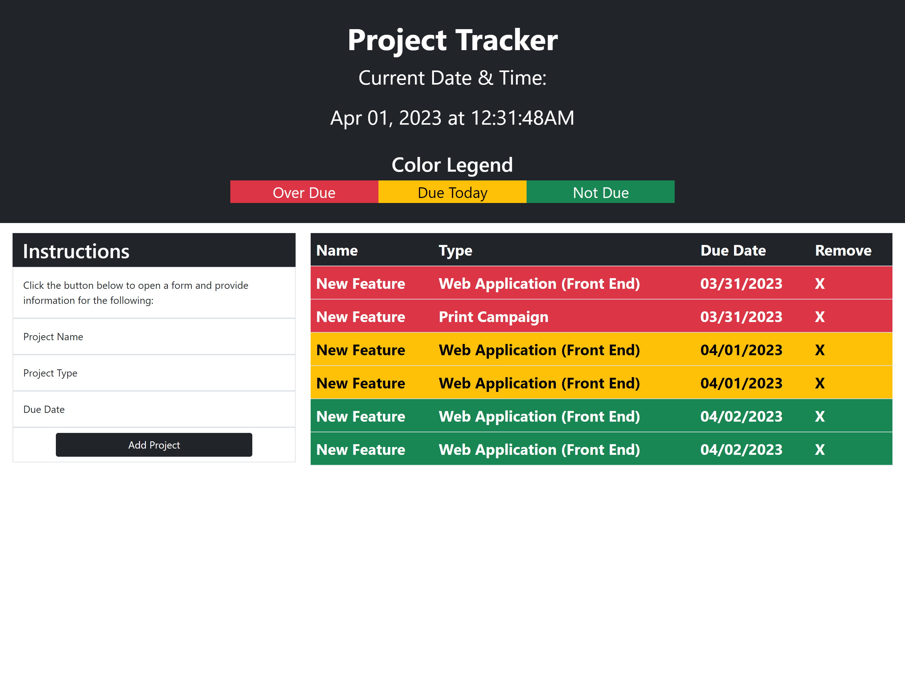

# Project-Tracker

## Description

This project uses Jquery, Jquery UI, Bootstrap and Dayjs API
This webpage makes it easy to track projects, due dates and displays when the projects are due with color coding.
Making this project, I got practice using Jquery selectors to select dynamically added table elements, how to use dayjs to check if they due date has passed or not, how to use bootstrap classes to structure the webpage and jQuery UI to make the date selector in the bootstrap modal.

## Usage

Click the Add Project button to bring up the bootstrap modal, enter the Name of the Project, Select from the drop down, and select the date. When Add Project button on the modal, is clicked the project will be added to the table and will be color coded  
Red = Over due.
Yellow = Today is the due date.  
Green = Not due yet.

Clicking on the X will remove the task from the table.
All the tasks are saved onto local storage, so that when webpage is refreshed or relaunched, tasks entered previously will still be there.

Live Deployed URL: https://timebytes.github.io/Project-Tracker/

## Credit

Mock up design and function provided by University of Toronto Bootcamp

## License

MIT License
